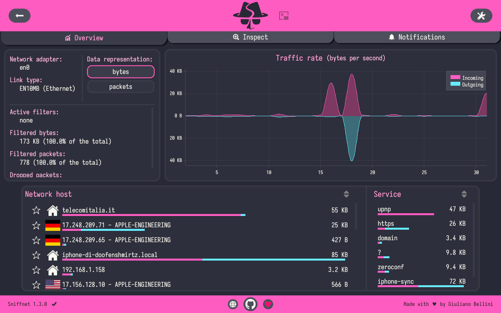

# Dracula for [Sniffnet](https://github.com/GyulyVGC/sniffnet)

> A dark theme for [Sniffnet](https://github.com/GyulyVGC/sniffnet).

## Install

All instructions can be found at [draculatheme.com/sniffnet](https://draculatheme.com/sniffnet).

## Team

This theme is maintained by the following person(s) and a bunch of [awesome contributors](https://github.com/dracula/sniffnet/graphs/contributors).

|  |  |
| ---------------------------------------------------------------------------------------- | --------------------------------------------------------------------------------------------- |
| [Giuliano Bellini](https://github.com/gyulyvgc)                                               | [Joshua Megnauth](https://github.com/joshuamegnauth54)                                               |

## Community

- [Twitter](https://twitter.com/draculatheme) - Best for getting updates about themes and new stuff.
- [GitHub](https://github.com/dracula/dracula-theme/discussions) - Best for asking questions and discussing issues.
- [Discord](https://draculatheme.com/discord-invite) - Best for hanging out with the community.

## License

[MIT License](./LICENSE)
